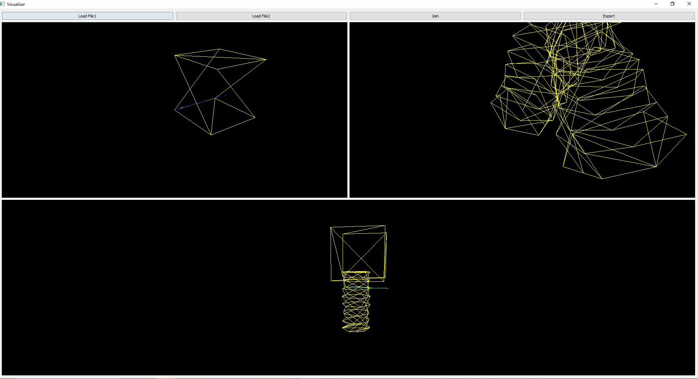
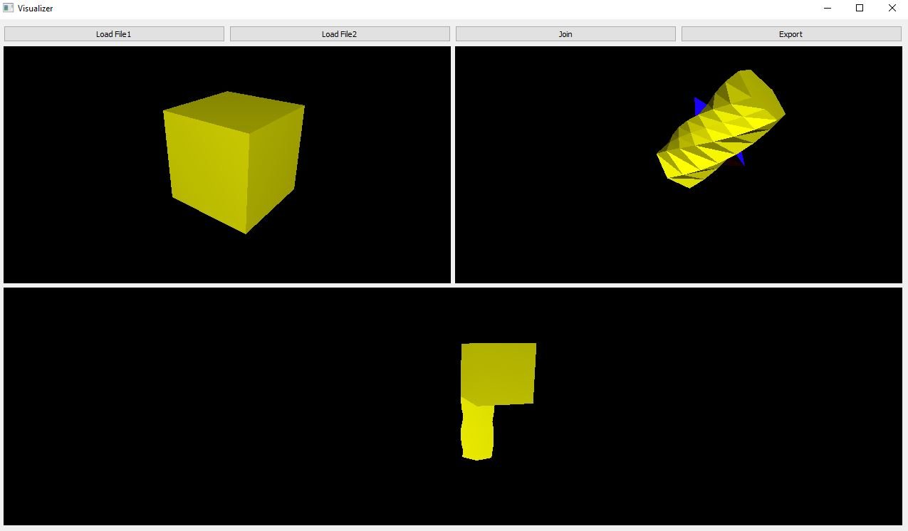

# Mesh Boolean  - Proof of Concept

This repository demonstrates boolean operations on 3D meshes. It includes core functionalities and visualization tools to illustrate the results.

## Features
- 3D mesh operation such as Join.
- Visualization of meshes in both wireframe and shaded modes.
- Support for both STL and OBJ file formats.

## Outputs
Here are example visualizations generated by this project:

### MeshBoolean Line Output

### MeshBoolean Triangles Output

